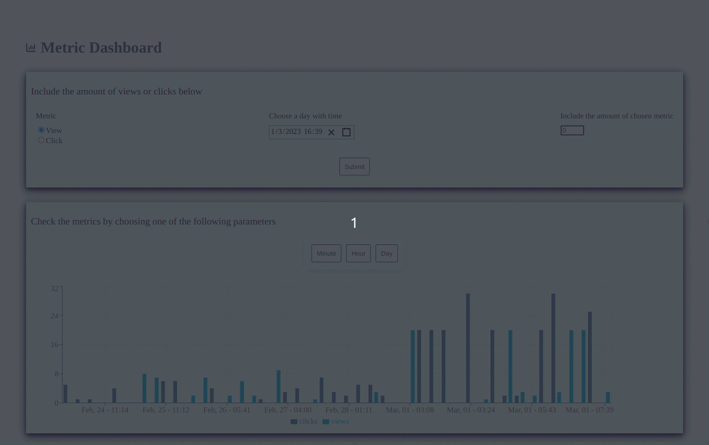
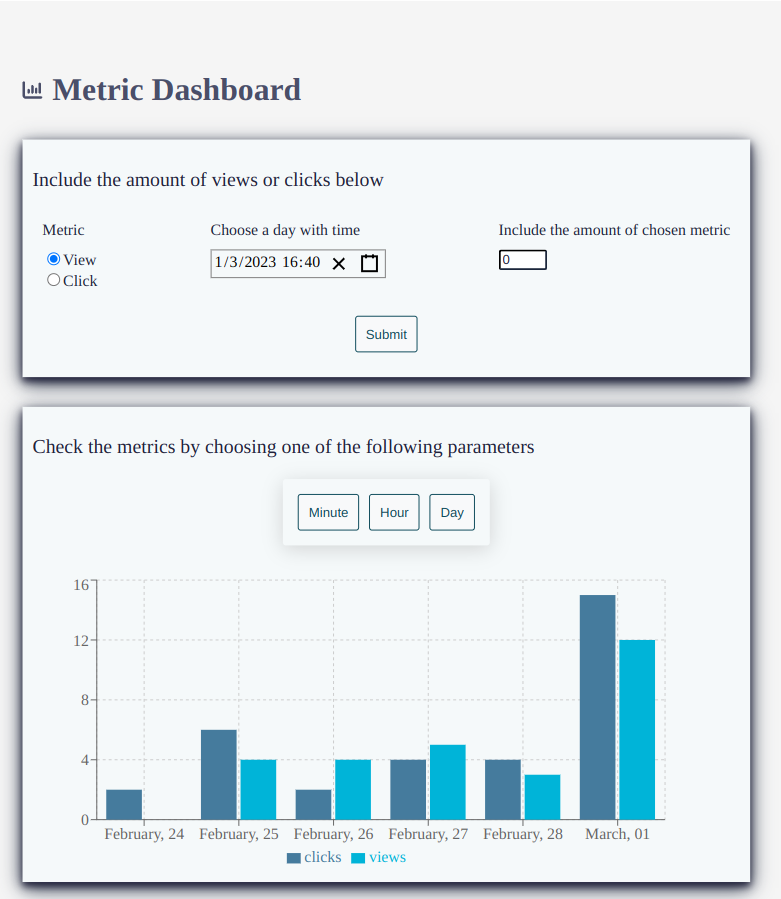

# Factorial - Growth Challenge

## Overview

The challenge is to build a Frontend + Backend application that allows to post and visualize metrics in a usable way.

Each metric have a timestamp, name, and value.

The metrics will be shown in a timeline and show averages per minute/hour/day and persisted in the database.

## Preview

## Available Scripts

**Before running this repo make sure the [backend](https://github.com/thsvr/challenge-backend-growth) is alrealy running.**

In the project directory, you can run:

### `npm i`

Install the project packages.

### `npm start`

Runs the app in the development mode.\
Open [http://localhost:3001](http://localhost:3001) to view it in the browser.

### `npm test`

Launches the test runner in the interactive watch mode.

### `npm lint`

Shows prettier and eslint warnings and errors.

### `npm lint:fix`

Fix prettier and eslint warnings and errors when possible.

## Technologies

Typescript

React - This project was bootstrapped with [Create React App](https://github.com/facebook/create-react-app).

[Styled-components](https://styled-components.com/)

[Jest Styled Component](https://github.com/styled-components/jest-styled-components)

[Recharts](https://recharts.org/en-US/examples/SimpleBarChart)

[React DateTime Picker](https://www.npmjs.com/package/react-datetime-pickerS)

[Fontawesome](https://fontawesome.com/v5/docs/web/use-with/react)

[Husky pre-commit](https://www.npmjs.com/package/husky)

 

 

### Author

👤 _Thaís Vieira_

[Github: @thsvr](https://github.com/thsvr)

[Thais' LinkedIn](https://www.linkedin.com/in/vr-ths-zd/)
